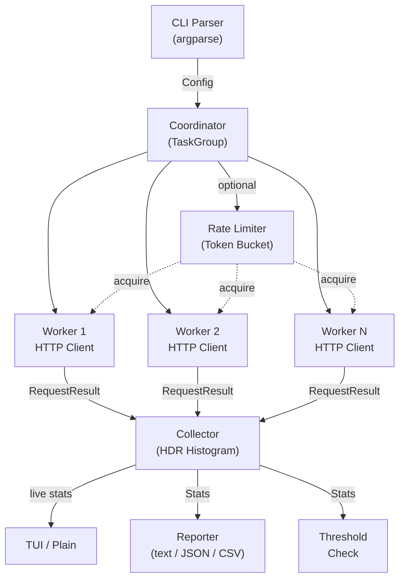

# molt

[](https://github.com/paveg/molt/actions/workflows/ci.yml)
[](https://codecov.io/gh/paveg/molt)
[](LICENSE)
[](https://github.com/paveg/molt/releases)

**Simple HTTP load testing CLI built with MoonBit.**


A lightweight, fast HTTP load testing tool inspired by [oha](https://github.com/hatoo/oha) and [hey](https://github.com/rakyll/hey). Built entirely in MoonBit using the native backend for direct I/O without WASM overhead.

## Features

**Load Generation**
- Configurable concurrent connections (`-c`)
- Duration (`-d 30s`) or request count (`-n 10k`) modes
- Fixed-rate mode with token bucket (`--rate`)
- Warm-up phase excluded from stats (`--warm-up`)
- Built-in test server (`--serve`)

**Measurement**
- Gil Tene HDR Histogram (3 significant figures, O(1) per record)
- TTFB (Time to First Byte) tracked separately
- Coordinated Omission correction under rate-limited load
- Custom percentiles (`--percentiles 50,90,99,99.99`)
- Response size tracking (bytes/sec)

**HTTP**
- All common methods: GET, POST, PUT, DELETE, PATCH, HEAD, OPTIONS
- Custom headers (`-H`), request body (`-b`, `-B`)
- Basic Auth (`--auth`), redirect following (`-L`)
- Per-request timeout (`-t`), keep-alive control

**Output**
- Real-time TUI dashboard (default)
- Plain text with periodic status (`--no-tui`)
- JSON with time-series data (`--json`)
- Streaming CSV per request (`--csv`)
- Debug mode: single request dump (`--debug`)

**CI/CD**
- SLA thresholds with exit codes (`--latency-threshold`, `--error-threshold`)
- Exit 0 (success), 1 (config error), 2 (test failures), 3 (threshold violation)
- Automated releases via release-please

## Installation

### Pre-built binary

Download from [GitHub Releases](https://github.com/paveg/molt/releases):

```sh
# macOS (Apple Silicon)
curl -sL https://github.com/paveg/molt/releases/latest/download/molt-darwin-arm64.tar.gz | tar xz
sudo mv molt /usr/local/bin/

# Linux (x86_64)
curl -sL https://github.com/paveg/molt/releases/latest/download/molt-linux-amd64.tar.gz | tar xz
sudo mv molt /usr/local/bin/
```

### Build from source

Requires [MoonBit](https://www.moonbitlang.com/) toolchain.

```sh
git clone https://github.com/paveg/molt.git && cd molt
moon build --target native --release
cp _build/native/release/build/src/cmd/main/main.exe /usr/local/bin/molt
```

## Quick Start

```sh
# Start the built-in test server
molt --serve 127.0.0.1:8080 &

# Run a load test against it
molt -c 10 -d 5s http://127.0.0.1:8080/

# Or test against your own server
molt -c 50 -d 30s http://localhost:3000/api/health
```

## Usage Examples

```sh
# Basic GET (50 connections, 10 seconds)
molt http://localhost:8080/

# POST with JSON body
molt -m POST -H 'Content-Type: application/json' \
  -b '{"name":"test"}' -c 20 -d 15s http://localhost:8080/api/users

# Fixed rate: 500 RPS
molt -r 500 -c 50 -d 30s http://localhost:8080/

# Request count with suffix
molt -n 10k -c 50 http://localhost:8080/

# SLA enforcement in CI
molt --latency-threshold 100ms --error-threshold 1.0 \
  -c 50 -d 30s http://localhost:8080/api/health

# JSON output for pipelines
molt --json -d 10s http://localhost:8080/ > results.json

# Warm-up: skip first 5 seconds
molt --warm-up 5s -c 20 -d 30s http://localhost:8080/

# Basic auth + custom timeout
molt --auth admin:secret -t 5s -c 10 -d 10s http://localhost:8080/api/protected

# Debug: inspect single request
molt --debug http://localhost:8080/api/health
```

## Sample Output

### Text mode (`--no-tui`)

```
molt v0.1.0 -- MoonBit HTTP Load Tester

Target:       http://127.0.0.1:9998/
Method:       Get
Connections:  5
Duration:     3s

Running...

[0.9s] 20118 requests | 20118 req/s | p50: 0.19ms | p99: 1.05ms | errors: 0
[1.9s] 40996 requests | 20498 req/s | p50: 0.18ms | p99: 1.16ms | errors: 0

Summary:
  Total requests:    57727
  Successful:        57727 (100.0%)
  Failed:            0 (0.0%)
  Total time:        3.0s
  Requests/sec:      19240.57

Latency Distribution:
  p50.00  0.20ms      p90.00  0.39ms
  p75.00  0.30ms      p95.00  0.48ms
  p99.00  1.21ms      p99.90  4.35ms
  max     12.56ms

  mean    0.25ms      stdev   0.31ms

TTFB (Time to First Byte):
  p50  0.19ms   p99  1.20ms   max  12.56ms

Status Codes:
  200: 57727
```

### JSON mode (`--json`)

<details>
<summary>Full JSON output</summary>

```json
{
  "config": {
    "url": "http://127.0.0.1:9998/",
    "connections": 2,
    "duration_sec": 1.00,
    "rate_rps": null,
    "timeout_ms": 30000,
    "method": "GET"
  },
  "summary": {
    "total_requests": 19155,
    "successful": 19155,
    "failed": 0,
    "total_time_sec": 1.00,
    "requests_per_sec": 19162.76
  },
  "latency": {
    "p50_ms": 0.09, "p75_ms": 0.10, "p90_ms": 0.13,
    "p95_ms": 0.18, "p99_ms": 0.31, "p99_9_ms": 0.77,
    "max_ms": 2.05, "min_ms": 0.06,
    "mean_ms": 0.10, "stdev_ms": 0.06
  },
  "ttfb": { "p50_ms": 0.09, "p99_ms": 0.30, "max_ms": 2.04 },
  "status_codes": { "200": 19155 },
  "errors": {},
  "custom_percentiles": { "p50.00_ms": 0.09, "p99.00_ms": 0.31 },
  "throughput": { "total_bytes": 0, "bytes_per_sec": 0.00 },
  "time_series": [
    { "elapsed_sec": 1.0, "requests": 19155, "rps": 19155.0, "p50_us": 91, "p99_us": 311, "errors": 0 }
  ]
}
```

</details>

## CLI Reference

```
Usage: molt [options] <url>
```

| Option | Short | Default | Description |
|---|---|---|---|
| **Load Control** | | | |
| `--connections` | `-c` | `50` | Concurrent connections |
| `--duration` | `-d` | `10s` | Test duration (`10s`, `1m`, `1m30s`) |
| `--requests` | `-n` | -- | Total request count, supports `10k`/`1m` suffixes |
| `--rate` | `-r` | -- | Target requests per second |
| `--warm-up` | | -- | Exclude initial period from stats (`3s`) |
| **HTTP** | | | |
| `--method` | `-m` | `GET` | HTTP method |
| `--header` | `-H` | -- | Custom header, repeatable |
| `--body` | `-b` | -- | Request body string |
| `--body-file` | `-B` | -- | Request body from file |
| `--auth` | | -- | Basic auth (`user:password`) |
| `--timeout` | `-t` | `30s` | Per-request timeout |
| `--redirect` | `-L` | off | Follow 3xx redirects (up to 10 hops) |
| `--disable-keepalive` | | off | New connection per request |
| `--insecure` | `-k` | off | Skip TLS verification ([pending upstream](https://github.com/moonbitlang/async/issues/329)) |
| **Output** | | | |
| `--no-tui` | | off | Plain text with periodic status |
| `--json` | `-j` | off | JSON output (implies `--no-tui`) |
| `--csv` | | off | Streaming per-request CSV |
| `--percentiles` | | `50,75,90,95,99,99.9` | Custom percentiles |
| **CI/CD** | | | |
| `--latency-threshold` | | -- | Fail if p99 exceeds value (`100ms`), exit 3 |
| `--error-threshold` | | -- | Fail if error rate exceeds % (`1.0`), exit 3 |
| **Other** | | | |
| `--debug` | | off | Single request with full response dump |
| `--serve` | | -- | Start built-in test server (`127.0.0.1:8080`) |

## Architecture



### Packages

| Package | Description |
|---|---|
| `cmd/main` | CLI parsing (`cli.mbt`) and orchestration (`main.mbt`) |
| `lib/types` | `Config`, `Stats`, `RequestResult`, `HttpMethod`, `base64_encode` |
| `lib/worker` | Async HTTP loop, TTFB, redirect, reconnection |
| `lib/coordinator` | `TaskGroup` orchestration, warm-up, time-series capture |
| `lib/collector` | Result aggregation with dual HDR Histogram (latency + TTFB) |
| `lib/histogram` | Gil Tene HDR Histogram (3 sig fig, 1us-1h, O(1) record) |
| `lib/reporter` | Text (`text.mbt`), JSON (`json.mbt`), CSV (`csv.mbt`), format helpers |
| `lib/tui` | Real-time TUI via [mizchi/tui](https://mooncakes.io/docs/mizchi/tui) |
| `lib/duration` | Duration/count parser (`"10s"`, `"1m30s"`, `"10k"`) |
| `lib/rate_limiter` | Absolute-deadline token bucket |
| `lib/threshold` | SLA threshold checking |

## Development

```sh
moon build --target native            # build
moon build --target native --release  # release build (~2.3 MB)
moon test --target native             # all 241 tests
moon test                             # wasm-gc subset
moon fmt                              # format
moon check --target native            # type check
```

## Comparison

| | molt | [oha](https://github.com/hatoo/oha) | [hey](https://github.com/rakyll/hey) | [k6](https://github.com/grafana/k6) |
|---|---|---|---|---|
| Language | MoonBit | Rust | Go | Go |
| HDR Histogram | Yes (3 sig fig) | Yes | No | Yes |
| TUI | Yes | Yes | No | No |
| TTFB | Yes | Yes | No | No |
| CO correction | Yes | Yes | No | Yes |
| SLA thresholds | Yes (exit 3) | Partial | No | Yes |
| CSV | Yes (streaming) | Yes | Yes | No |
| HTTP/2 | No (planned) | Yes (+HTTP/3) | Yes | Yes |
| Scenarios | No | No | No | Yes (JS) |
| Binary | ~2.3 MB | ~3 MB | ~5 MB | ~40 MB |

## AI Agent Integration

molt is available as a [Vercel Skill](https://skills.sh/) — AI coding agents (Claude Code, Copilot, Cursor, etc.) can learn to use molt for load testing.

```sh
# Install the molt skill for your agent
npx skills add paveg/molt
```

Once installed, you can ask your AI agent things like:
- "Load test this API endpoint at 100 RPS for 30 seconds"
- "Run a quick smoke test on localhost:3000"
- "Benchmark the /api/users endpoint with POST requests"

The agent will construct and run molt commands, then analyze the results.

## Roadmap

- [ ] `--http2` HTTP/2 support ([upstream PR](https://github.com/moonbitlang/async/pull/305) in progress)
- [ ] `--insecure` actual TLS skip ([upstream issue](https://github.com/moonbitlang/async/issues/329))

## License

[Apache-2.0](LICENSE)
